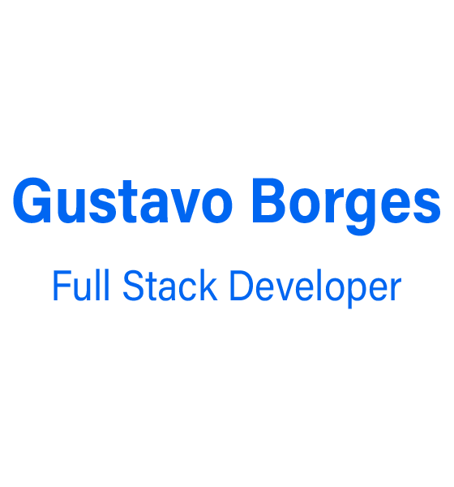

  
  

  
  

## Hi there! 

</h2>

### Abstract 

  Hello, my name is Gustavo I am <strong> Full-stack developer </strong>.  
  Graduated in Information Systems from the State University of Goiás in Brazil. Currently working as a freelance developer. 
  More than 5 years working in the information technology. 
  In constant search and improvement of knowledge.   

- 👨‍💻 I'm currently working full-time at **Maleta do Engenheiro**.
- 🌱 Learning more about and studying: **NodeJS, ReactJS, React Native and SpringBoot**.

### Languages and Tools

 
  

  

  

  

   

  

  

  

  

  

  

  

  

  

  

  

  

 

##

### Find me around the web 🌎:

  
  
  
[Snake animation](https://github.com/gustavobcardoso/gustavobcardoso/blob/output/github-contribution-grid-snake.svg)